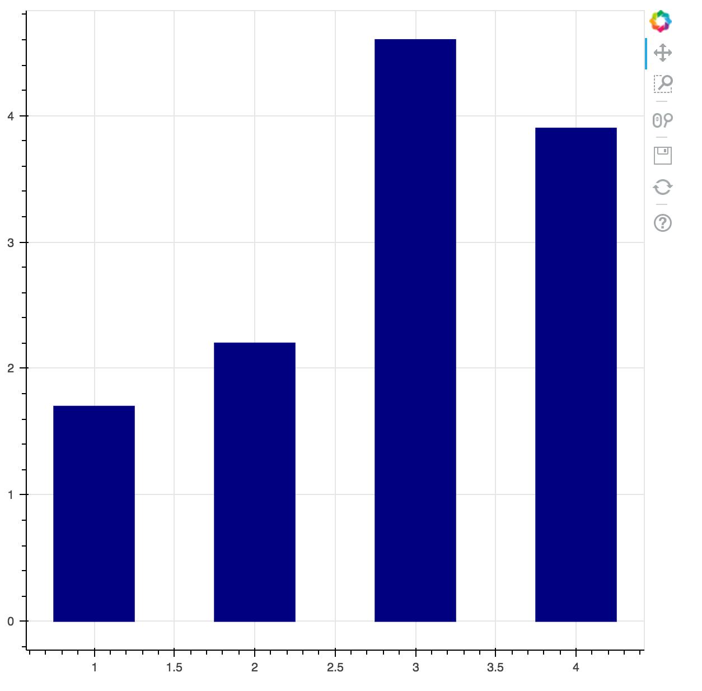

# Flask Bokeh Example

## Want to learn how to build this project?

Check out the [tutorial](tutorial.md).

## Want to use this project?

1. Fork/Clone
1. Create and active a virtualenv
1. Install dependencies
1. `python app.py`

## Sample

  

